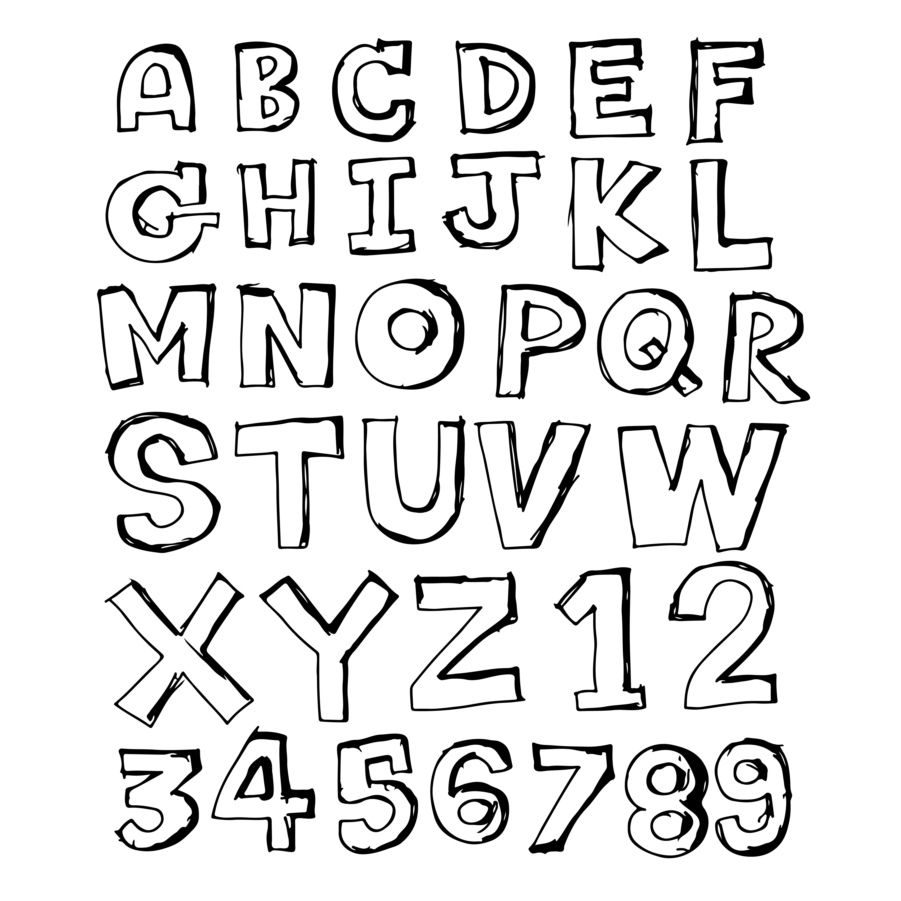

# Copywrite Challenge

The following project it's a technical challenge for Copywrite a colombian software company. currently    applied for a fullstack developer position. And here it's the code-repository but also thapp can be used     [here](https://copywrite-reverse-word.vercel.app/).

It's  simple but efficient and usefull client who calls to a singled-endpoint API for reversing thtext    passed by as a query param.

More specific documentation on each end (front and back) it's marked down on the respectively folders.

I hope you enjoy watching my code and using my app as much as I did developing, best of regards!

        — Juan

